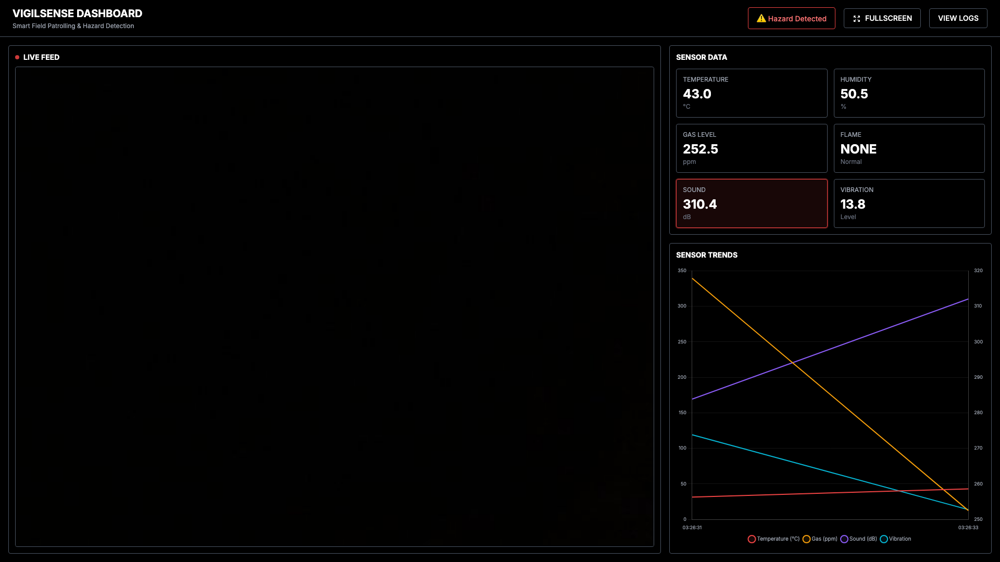

# 🚨 VigilSense – Smart Field Patrolling & Hazard Detection Bot

[](https://www.python.org/)
[](https://flask.palletsprojects.com/)
[](https://www.arduino.cc/)
[](LICENSE)

> **An intelligent IoT bot system with real-time hazard detection, live video streaming, person detection, and remote control capabilities**

VigilSense combines **Raspberry Pi**, **Arduino UNO R4 WiFi**, and **AI-powered computer vision** to create a comprehensive monitoring and patrolling solution. Features include live camera streaming with YOLOv8 person detection, real-time sensor monitoring, hazard detection, and Bluetooth/WiFi-controlled motor system.

---

## ✨ Features

### 🎥 **Live Video & AI Detection**
- **Real-time MJPEG streaming** from Pi Camera v3
- **YOLOv8 person detection** with bounding boxes
- **Live person count** displayed on video feed
- **Responsive web interface** with dark theme

### 📊 **Real-time Sensor Monitoring**
- **Temperature & Humidity** (DHT11)
- **Gas Detection** (MQ sensor)
- **Flame Detection** (Digital flame sensor)
- **Sound Detection** (Microphone)
- **Vibration Detection** (Analog sensor)
- **Color-coded alerts** for hazard thresholds
- **Interactive sensor trend graphs** (Chart.js)

### 🤖 **Remote Motor Control**
- **Bluetooth Low Energy (BLE)** control via Bluefruit Connect app
- **WiFi web interface** for browser control
- **4-motor control** with L293D driver
- **Speed control** and directional commands
- **Real-time status feedback**

### 📱 **Modern Web Dashboard**
- **Premium dark theme** with glassmorphism effects
- **Responsive design** (mobile-friendly)
- **Fullscreen mode** support
- **Detection log table** with filtering
- **System status banner** with alerts
- **No-scroll single-viewport** layout

### 🔧 **Hardware Integration**
- **Raspberry Pi** for video processing and web server
- **Arduino UNO R4 WiFi** for sensor data and motor control
- **Pi Camera v3** for live video streaming
- **Multiple sensors** for comprehensive monitoring

---

## 📸 Screenshots


*Main dashboard with live camera feed, sensor cards, and trend graphs*


*Detailed detection log table with timestamp and sensor readings*

---

## 🏗️ Architecture

```
┌─────────────────┐         ┌──────────────────┐         ┌──────────────┐
│   Raspberry Pi  │◄───────►│  Arduino UNO R4  │◄───────►│   Sensors    │
│                 │  Serial │   WiFi            │         │   & Motors   │
│  - Flask Server │         │  - Sensor Reader  │         │              │
│  - YOLOv8 AI    │         │  - Motor Control  │         │              │
│  - Pi Camera v3 │         │  - BLE/WiFi       │         │              │
└─────────────────┘         └──────────────────┘         └──────────────┘
         │
         │ HTTP/MJPEG Stream
         ▼
┌─────────────────┐
│  Web Browser    │
│  / Mobile App   │
└─────────────────┘
```

---

## 🚀 Quick Start

### Prerequisites

- **Raspberry Pi** (4B recommended) with Pi Camera v3
- **Arduino UNO R4 WiFi**
- **L293D Motor Driver** (1 or 2 chips)
- **4 DC Motors**
- **Sensors**: DHT11, MQ Gas, Flame, Microphone, Vibration
- Python 3.8+ on Raspberry Pi
- Arduino IDE or Arduino CLI

### 1. Clone the Repository

```bash
git clone https://github.com/StarkAg/vigil-sense-dashboard.git
cd vigil-sense-dashboard
```

### 2. Install Dependencies

```bash
pip3 install --break-system-packages -r requirements.txt
```

### 3. Hardware Setup

#### Sensor Connections (Arduino)
- **DHT11** → Digital D4
- **Gas Sensor** → Analog A0
- **Vibration** → Analog A3
- **Flame Sensor** → Digital D7
- **Microphone** → Digital D9

See [HARDWARE_SETUP.md](HARDWARE_SETUP.md) for detailed wiring.

#### Motor Connections (Arduino)
- **Motor 1**: IN1=D2, IN2=D3, ENA=D5
- **Motor 2**: IN3=D4, IN4=D7, ENB=D6
- **Motor 3**: IN1=D8, IN2=D9, ENA=D10
- **Motor 4**: IN3=D11, IN4=D12, ENB=D13

See [MOTOR_CONTROL_SETUP.md](MOTOR_CONTROL_SETUP.md) for details.

### 4. Upload Arduino Code

#### For Sensor Data Collection:
```bash
# Using Arduino IDE: Open arduino_code.ino and upload
# Or using Arduino CLI:
arduino-cli compile --fqbn arduino:renesas_uno:unor4wifi arduino_code/
arduino-cli upload -p /dev/ttyACM0 --fqbn arduino:renesas_uno:unor4wifi arduino_code/
```

#### For Motor Control:
```bash
# Bluetooth version (recommended):
./upload_motor_control_ble.sh

# Or WiFi version:
./upload_motor_control.sh
```

### 5. Deploy to Raspberry Pi

```bash
# Automated deployment:
./deploy_to_pi.sh

# Or manually:
scp -r . pi@raspberrypi.local:~/vigil_sense_dashboard/
ssh pi@raspberrypi.local
cd ~/vigil_sense_dashboard
pip3 install --break-system-packages -r requirements.txt
python3 app.py
```

### 6. Access the Dashboard

Open your browser and navigate to:
```
http://raspberrypi-ip:8080
```

Or if running locally:
```
http://localhost:8080
```

---

## 📚 Documentation

### Core Documentation
- **[HARDWARE_SETUP.md](HARDWARE_SETUP.md)** - Complete hardware wiring guide
- **[ARDUINO_SETUP.md](ARDUINO_SETUP.md)** - Arduino IDE setup and upload instructions
- **[MOTOR_CONTROL_SETUP.md](MOTOR_CONTROL_SETUP.md)** - Motor driver and control setup
- **[L293D_PIN_REFERENCE.md](L293D_PIN_REFERENCE.md)** - Detailed L293D pin reference

### Control Interfaces
- **[BLUETOOTH_SETUP.md](BLUETOOTH_SETUP.md)** - Bluetooth control with Bluefruit app
- **[BLUEFRUIT_SETUP.md](BLUEFRUIT_SETUP.md)** - Bluefruit Connect app guide
- **[PIN_CONFIRMATION.md](PIN_CONFIRMATION.md)** - Pin configuration verification

### API Documentation

#### Camera Stream
```
GET /stream.mjpg
```
Returns MJPEG video stream with YOLOv8 person detection overlay.

#### Sensor Data
```
GET /api/sensors
```
Returns JSON:
```json
{
  "temperature": 25.5,
  "humidity": 60.0,
  "gas": 450,
  "flame": 0,
  "sound": 1,
  "vibration": 512
}
```

#### Detection Logs
```
GET /api/logs
```
Returns array of last 10 detection entries.

#### System Status
```
GET /api/status
```
Returns:
```json
{
  "status": "normal",
  "message": "✅ All Systems Normal"
}
```

#### Person Count (YOLO)
```
GET /api/people
```
Returns:
```json
{
  "count": 2,
  "yolo_enabled": true
}
```

---

## 🎮 Motor Control Commands

### Bluetooth Commands (via Bluefruit UART)
- `forward` / `f` / `w` - Move forward
- `backward` / `b` / `s` - Move backward
- `left` / `l` / `a` - Turn left
- `right` / `r` / `d` - Turn right
- `stop` / `x` - Stop all motors
- `speedup` / `+` - Increase speed
- `speeddown` / `-` - Decrease speed
- `speed:200` - Set speed (100-255)

### WiFi Commands (via Browser)
- Navigate to `http://[arduino-ip]/forward`
- Or use the web interface controls

---

## 🛠️ Technology Stack

### Backend
- **Flask** - Web framework
- **OpenCV** - Image processing
- **Ultralytics YOLOv8** - Person detection
- **PySerial** - Arduino communication
- **Gevent** - Async server

### Frontend
- **TailwindCSS** - Styling (CDN)
- **Chart.js** - Data visualization
- **Vanilla JavaScript** - Real-time updates

### Hardware
- **Raspberry Pi OS** - Linux-based OS
- **Arduino UNO R4 WiFi** - Microcontroller
- **rpicam-vid** - Pi Camera v3 streaming
- **L293D** - Motor driver

---

## 📁 Project Structure

```
vigil_sense_dashboard/
├── app.py                          # Flask backend with YOLO
├── requirements.txt                 # Python dependencies
├── templates/
│   ├── index.html                  # Main dashboard
│   └── logs.html                   # Detection logs page
├── static/
│   ├── css/
│   │   └── style.css              # Custom styles
│   └── js/
│       └── dashboard.js           # Frontend logic
├── arduino_code.ino                # Sensor data collection
├── arduino_motor_control_ble.ino  # Bluetooth motor control
├── arduino_motor_control.ino      # WiFi motor control
├── deploy_to_pi.sh                 # Deployment script
├── upload_motor_control*.sh       # Motor control upload scripts
└── docs/
    ├── HARDWARE_SETUP.md
    ├── ARDUINO_SETUP.md
    ├── MOTOR_CONTROL_SETUP.md
    └── ...
```

---

## 🔧 Configuration

### WiFi Credentials (Arduino Motor Control)
Edit `arduino_motor_control.ino`:
```cpp
const char* ssid = "YourWiFiName";
const char* password = "YourPassword";
```

### Sensor Thresholds (Flask)
Edit `app.py` to adjust alert thresholds:
```python
# Hazard detection thresholds
TEMP_THRESHOLD = 35.0
GAS_THRESHOLD = 500
```

### Camera Settings
Modify `init_camera()` in `app.py`:
```python
'--width', '1280',
'--height', '720',
'--framerate', '30',
```

---

## 🐛 Troubleshooting

### Camera Not Streaming
```bash
# Kill any existing camera processes
pkill -9 rpicam-vid

# Restart the dashboard
python3 app.py
```

### Arduino Not Detected
```bash
# Check serial port
ls /dev/ttyACM* /dev/ttyUSB*

# Test connection
python3 test_arduino.py
```

### YOLO Model Not Loading
```bash
# Install ultralytics
pip3 install --break-system-packages ultralytics

# First run will download model (~6MB)
```

### Bluetooth Connection Issues
- Ensure Arduino code is uploaded
- Check Serial Monitor for "BLE initialized"
- Restart Bluefruit Connect app
- Verify phone Bluetooth is enabled

---

## 🤝 Contributing

Contributions are welcome! Please feel free to submit a Pull Request.

1. Fork the repository
2. Create your feature branch (`git checkout -b feature/AmazingFeature`)
3. Commit your changes (`git commit -m 'Add some AmazingFeature'`)
4. Push to the branch (`git push origin feature/AmazingFeature`)
5. Open a Pull Request

---

## 📝 License

This project is licensed under the MIT License - see the [LICENSE](LICENSE) file for details.

---

## 👤 Author

**StarkAg**

- GitHub: [@StarkAg](https://github.com/StarkAg)
- Project Link: [https://github.com/StarkAg/vigil-sense-dashboard](https://github.com/StarkAg/vigil-sense-dashboard)

---

## 🙏 Acknowledgments

- **Ultralytics** for YOLOv8 model
- **Adafruit** for Bluefruit Connect app
- **Arduino** community for hardware support
- **Raspberry Pi** Foundation for Pi Camera support

---

## 📊 Project Status


**Current Version**: 2.0
- ✅ Live video streaming with YOLOv8
- ✅ Real-time sensor monitoring
- ✅ Bluetooth motor control
- ✅ WiFi motor control
- ✅ Comprehensive documentation
- 🔄 Active development

---

## 🌟 Star History

If you find this project useful, please consider giving it a star ⭐!

---

**Made with ❤️ for IoT and Robotics enthusiasts**

